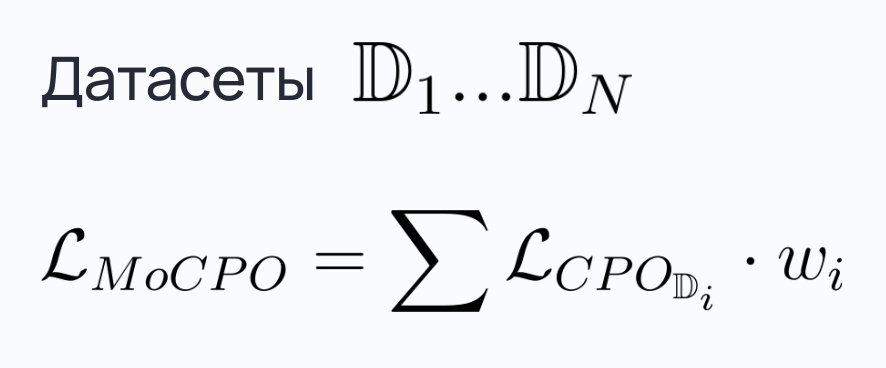
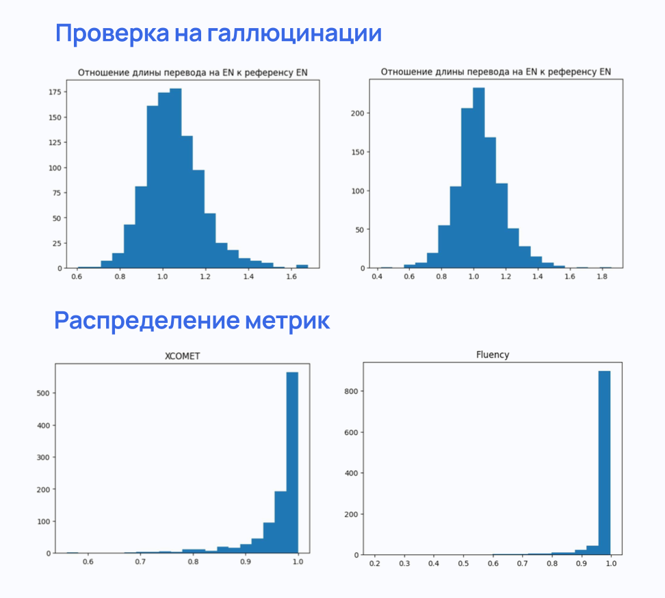

# Интенсив по воспроизведению state‑of‑the‑art научных результатов 2024, Яндекс, Сириус

# Multi-objective LLM Alignment for Machine Translation

## Related papers 

[X-ALMA: PLUG & PLAY MODULES AND ADAPTIVE REJECTION FOR QUALITY TRANSLATION AT SCALE](https://arxiv.org/pdf/2410.03115)

[Beyond One-Preference-Fits-All Alignment: Multi-Objective Direct Preference Optimization (MODPO)](https://arxiv.org/pdf/2310.03708)

[Direct Preference Optimization:
Your Language Model is Secretly a Reward Model (DPO)](https://arxiv.org/pdf/2305.18290)

[Contrastive Preference Optimization: Pushing the Boundaries of LLM Performance in Machine Translation (CPO)](https://arxiv.org/pdf/2401.08417)

[Aligning language models to follow instructions](https://openai.com/index/instruction-following/)

[xCOMET: Transparent Machine Translation Evaluation through Fine-grained Error Detection](https://arxiv.org/pdf/2310.10482)

## Постановка задачи

1) Выбрать существующую LLM модель машинного перевода 
2) Произвести Alignment способами DPO, CPO, MODPO, MOCPO
3) Сравнить результаты 

RU-EN перевод

## Модель

[X-ALMA-13B-Pretrain](https://huggingface.co/haoranxu/X-ALMA-13B-Pretrain),
[GitHub репозиторий](https://github.com/fe1ixxu/ALMA)

SotA Machine Translation, 50 языков, архитектура LLaMA2

## Alignment
### CPO

Contrastive preference optimization

**Идея:** повысить вероятность удачного варианта, понизить - неудачного

Для обучения необходим [датасет](https://huggingface.co/datasets/marulyanova/ALMA-R-Preference-F) вида **<source, winner, loser>**. Отобраны 2009 ru-en пар из [ ALMA-preference](https://huggingface.co/datasets/haoranxu/ALMA-R-Preference/viewer/ru-en/train?p=2).

### DPO

Direct preference optimization

**Идея:** как CPO, но не пытаемся повысить вероятность winner

### MO (Multi Objective)

**Идея**: взвешенная оптимизация по нескольким метрикам

[Датасет для Multi Objective](https://huggingface.co/datasets/marulyanova/PKU-SafeRLHF-10K-Modified)

## Метрики

[XCOMET-XL](https://huggingface.co/Unbabel/XCOMET-XL), [KIWI](https://huggingface.co/Unbabel/wmt23-cometkiwi-da-xxl), [Fluency](https://huggingface.co/cointegrated/roberta-large-cola-krishna2020)

## Валидация

[FLORES-200](https://huggingface.co/datasets/haoranxu/FLORES-200) 1012 пар

| Модель  | XCOMET | Fluency |
| ------------- | ------------- | ------------- |
| CPO 3 metrics  | 96.26  | **97.38** |
| CPO xcomet  | **96.29**  | 97.28 |
| CPO kiwi  | 96.25  | 97.27 |
| MODPO  | 93.77  | 93.58 |
| X-ALMA  | 95.12  | 94.57 |
| MOCPO  | 95.71  | 96.73 |

## Выводы

* Любой Alignment превосходит SFT X-ALMA
* CPO > DPO
* Гипотеза о улучшении засчёт учёта нескольких направлений выравнивания одновременно не подтвердилась

----------------

[Подготовка датасета для CPO](alma_dataset.ipynb), [DPO](ALMA_DATASET-2.ipynb)

[Train CPO, DPO](ALMA_BASELINE-2.ipynb)

[метрики1](CheckAdequacy.ipynb) [метрики2](ComputeDPOMetrics.ipynb) [метрики3](ComputeMetrics.ipynb) 

[TrainMOCPO](TrainMOCPO.ipynb)

[TrainMODPO](TrainMODPO.ipynb)